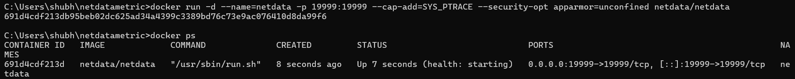
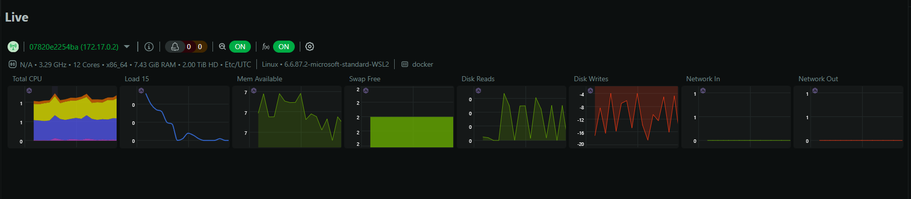
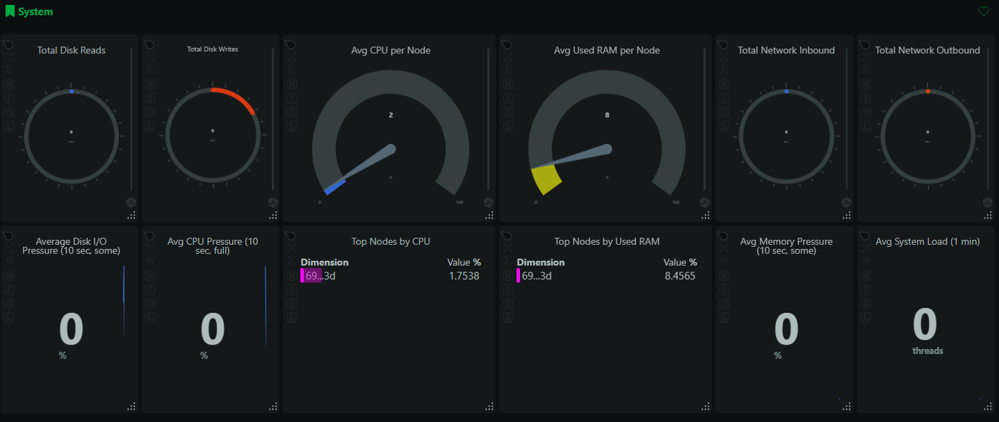
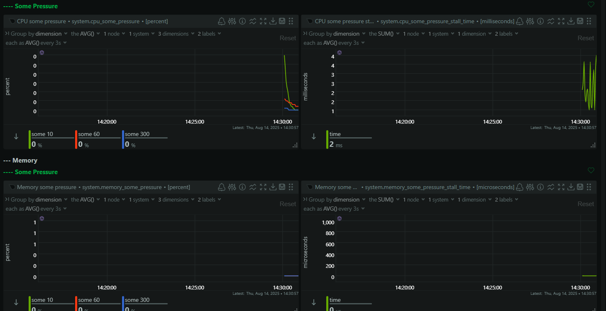

## 📌 Objective
Install **Netdata** using Docker and visualize system and application performance metrics in real time.

---

## 🛠 Tools Used
- **Netdata** → Free, open-source, real-time performance monitoring tool
- **Docker** → Containerization platform to run Netdata without manual installation
- **Web Browser** → For accessing the dashboard

---

## 📋 Steps Performed

### 1️⃣ Prerequisites
- Installed **Docker Desktop**
- Verified installation:
  ```bash
  docker --version

**Screenshots**





